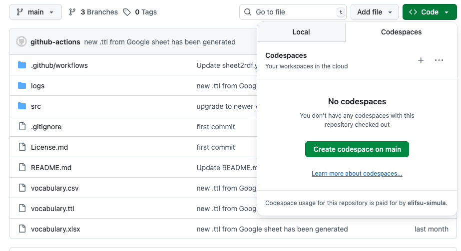

# Publishing Your Own Controlled Vocabulary
1. Create your vocabulary on Google Sheets. Please check out the [M4Mvocab - Wiki](https://github.com/gofair-foundation/M4Mvocab-Training/wiki) page for more information on how to build your vocabulary. The Wiki is accessible to those who have attended GFF training.

2. Create an Ubuntu virtual machine to host your Skosmos server. You can follow one of these tutorials: [Google Cloud](https://cloud.google.com/compute/docs/instances/create-start-instance), [Amazon Web Services](https://aws.amazon.com/getting-started/launch-a-virtual-machine-B-0/), [Microsoft Azure](https://learn.microsoft.com/en-us/azure/virtual-machines/linux/quick-create-portal?tabs=ubuntu).

3. Deploy Skosmos on your VM by following the [tutorial](https://github.com/NatLibFi/Skosmos/wiki/InstallTutorial). Also check out [Deploying Skosmos](#deploying-skosmos) section below.

4. Create your Github repository using this template.

5. Go to **Settings -> Secrets and variables -> Actions -> New repository secret** and add the following secrets:
- **`FILE_NAME`** — base name for output files (e.g., `vocabulary`)  
- **`SHEET_ID`** — ID of your Google Sheet. You can find it from its URL.
- **`GRAPH`** — URI of the named graph to publish to  
- **`DB_USER`** — Fuseki database username  
- **`DB_PASS`** — Fuseki database password  
- **`SPARQL_ENDPOINT`** — URL of your Graph Store SPARQL endpoint  


6. Preview your vocabulary before publishing. You can follow the steps in the section [Previewing Vocabulary in GitHub Codespaces](#previewing-vocabulary-in-github-codespaces).

7. After you preview your vocabulary and want to publish it, Go to **Actions → Sheet2RDF**, then click **Run workflow**.


# Deploying Skosmos
The official [tutorial](https://github.com/NatLibFi/Skosmos/wiki/InstallTutorial) assumes a local VM setup. When using a cloud VM, you need to:

1. Replace `localhost` in tutorial instructions with your VM’s public IP.

2. Open inbound TCP port **3030** in your VM’s network settings. You can find the tutorials for [Google Cloud](https://cloud.google.com/firewall/docs/using-firewalls), [Amazon Web Services](https://docs.aws.amazon.com/AWSEC2/latest/UserGuide/changing-security-group.html#add-remove-security-group-rules), [Microsoft Azure](https://learn.microsoft.com/en-us/azure/virtual-network/manage-network-security-group?tabs=network-security-group-portal).

3. If the `apt install` command fails in section [Install Apache and PHP](https://github.com/NatLibFi/Skosmos/wiki/InstallTutorial#install-apache-and-php), try running the following commands instead:

   ```
   sudo apt update
   sudo apt install apache2 libapache2-mod-php8.1 php8.1 php8.1-xml php8.1-intl php8.1-mbstring php8.1-curl
   ```

4. If the `php composer.phar install --no-dev` command fails in the section [Install Skosmos](https://github.com/NatLibFi/Skosmos/wiki/InstallTutorial#install-skosmos), try running the following commands instead:

   ```
   sudo apt update
   sudo apt install -y php8.1-zip unzip composer
   composer clear-cache
   php composer.phar install --no-dev
   ```


# Previewing Vocabulary in Skosmos Using GitHub Codespaces

**Note:** In order to use codespaces for previewing, you have to be added as a **Collaborator** to the repository.

If you have updated the Google Sheet and want to preview the vocabulary in Skosmos before deploying:

1. Go to **Settings -> Secrets and variables -> Codespaces -> New repository secret** and add the following secrets:
- **`FILE_NAME`** — base name for output files (e.g., `vocabulary`)  
- **`SHEET_ID`** — ID of your Google Sheet. You can find it from its URL.

2. In your GitHub repo, go to **Code -> Codespaces -> Create codespace on main**. This starts a VS Code environment and brings up Skosmos in Docker for preview.

   

3. Wait a few minutes for containers to start. Once it is ready you can find the links to Skosmos in terminal.

   

4. If you make changes to the Google Sheet, press **F1** and run **Codespaces: Rebuild Container** to restart services with the new changes.
5. If the containers don’t start, press **F1** and run **Codespaces: View creation log** to see startup logs.
6. When you’re done, delete the Codespace (free plan includes ~60 hours/month).


# Previewing Vocabulary Hierarchy Using SKOS Play

If you want to quickly test your vocabulary, you can follow these steps:

1. Download your vocabulary as a `.xls` file.

2. Download [XLS2RDF](https://github.com/sparna-git/xls2rdf/releases/download/2.1.1/xls2rdf-app-2.1.1-onejar.jar) and rename the file to `xls2rdf.jar`.

3. Download [SKOS Play](https://github.com/sparna-git/skos-play/releases/download/0.9.1/skos-play-cli-0.9.1-onejar.jar) and rename the file to `skos-play.jar`.

4. Make sure all three are in the same folder.

5. Run the following command to generate `.ttl` file from the `.xls` file.
   ```
   java -jar xls2rdf.jar convert -i FILE_NAME.xlsx -o FILE_NAME.ttl -l en
   ```

6. After you obtain the `.ttl` file, you can create an `.html` file to open in a browser and visualize the hierarchy with the following command:
   ```
   java -jar skos-play.jar hierarchical -i FILE_NAME.ttl -o FILE_NAME.html -f html -l en
   ```

# Recommended License for the Vocabulary
We recommend using the Creative Commons Attribution 4.0 International (CC BY 4.0) license for vocabularies.
